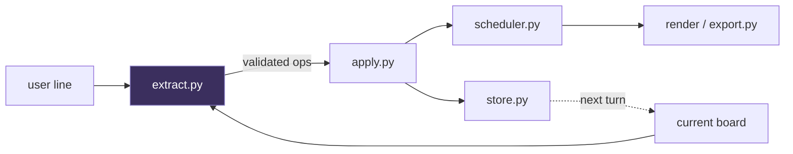

# localplan

A day planner you talk to in plain English, running entirely on your own machine.

No API key, no network calls, no data leaving your laptop. But the planner is
really a case study for one idea:

> **The language model reads your words. Deterministic Python does everything else.**

The model never schedules anything, never does arithmetic, never invents an
identifier, and never returns application state. It emits a list of *edit
operations* against a board it was shown — and ordinary, unit-tested Python
decides what those operations actually do.

## Demo

```
$ localplan plan
Localplan — describe your day, then refine it turn by turn.
Commands: 'clear' resets, 'export' writes plan.md, empty line or 'quit' exits.

> standup at 9, half an hour
Your day:
  09:00-09:30  Standup

> write the quarterly report, takes 2 hours
Your day:
  09:00-09:30  Standup
  09:30-11:30  Write the quarterly report  (flexible)

> dentist at 3pm for 45 minutes
Your day:
  09:00-09:30  Standup
  09:30-11:30  Write the quarterly report  (flexible)
  15:00-15:45  Dentist

> actually make the report 3 hours
Your day:
  09:00-09:30  Standup
  09:30-12:30  Write the quarterly report  (flexible)
  15:00-15:45  Dentist

> drop the standup
Your day:
  09:00-12:00  Write the quarterly report  (flexible)
  15:00-15:45  Dentist
```

Note the last two turns. `"actually make the report 3 hours"` resolves a fuzzy
phrase to a specific task id and changes only its duration. `"drop the standup"`
removes the 09:00 anchor, and the flexible block re-flows into the freed time —
because the schedule is *recomputed from scratch* every turn by a pure function,
not patched incrementally by the model.

## Quickstart

Requires [Ollama](https://ollama.com) and [uv](https://docs.astral.sh/uv/).

```bash
ollama pull qwen3.5:9b
git clone https://github.com/sanket-cpu/localplan && cd localplan
uv run localplan plan
```

That's the whole setup. Nothing to sign up for.

## How it works



Every turn does the same four things:

1. **Understand** — [`extract.py`](src/localplan/extract.py) sends the current
   board plus the user's line to the model, and gets back edit ops.
2. **Apply** — [`apply.py`](src/localplan/planner/apply.py) mutates the board.
   This is the only place mutation happens.
3. **Schedule** — [`scheduler.py`](src/localplan/planner/scheduler.py) recomputes the
   whole timeline from the tasks.
4. **Persist** — [`store.py`](src/localplan/store.py) writes the board to disk so
   the conversation survives restarts.

### The boundary

`extract.py` is the only module in the codebase that imports `ollama`. Everything
else is deterministic Python that would behave identically if the model were
replaced by a lookup table.

| The model decides | Python decides |
| --- | --- |
| What the user meant | What that actually changes |
| Which existing task "the gym" refers to | Whether that task exists |
| That `"2 hours"` means `120` | Where 120 minutes fit in the day |
| Which verb applies (add/remove/move/set_duration) | Task ids, all time math, conflict detection, ordering |

The type signatures enforce the split. The model emits `fixed_start` as a raw
`"HH:MM"` **string**; the scheduler emits `datetime.time` **objects**. That type
change *is* the boundary crossing — strings of understanding in, computed clock
times out.

### Ops, not state

The obvious design is to have the model return the updated task list each turn.
This project deliberately does the opposite: the model returns only a list of
`add` / `remove` / `move` / `set_duration` operations
([`models.py`](src/localplan/models.py)), and Python applies them.

The reason is testability. When the model returns state, there is no seam between
"the model misunderstood" and "the app is broken", and no way to unit-test the
mutation logic without invoking a model. With ops, every edit is a plain data
structure, and `apply_ops` is a pure function you can exhaustively test — which
is exactly what [`tests/test_apply.py`](tests/test_apply.py) does, with zero
model calls.

### Failures are data, not exceptions

Nothing in the deterministic layer raises on bad input from the model.

- An op referencing an id that isn't on the board is skipped and reported as a
  `problem` string; every other op in the batch still applies.
- Two overlapping fixed appointments are reported as a `conflict` and both are
  kept. The planner refuses to silently pick a winner.
- A flexible task that doesn't fit anywhere is listed under "Could not fit".

Refuse and report, never crash, never silently drop.

### Constrained decoding

Ops are generated under a JSON schema passed to Ollama's `format` parameter, so
the output is structurally valid by construction rather than by parsing and
praying.

One sharp edge, handled in
[`_require_all`](src/localplan/extract.py): Pydantic marks any field with a
default as optional — including the `op` discriminator. Constrained decoding
follows the schema literally, so the model would drop `op` from later array
elements and the discriminated union would fail with `union_tag_not_found`.
Forcing every property to `required` in the schema handed to the model fixes it,
while validation still uses the real Pydantic types.

## Tests

```bash
uv run pytest
```

52 tests, no model calls, runs in well under a second. The deterministic layer is
fully reachable by unit tests by design.

## Status and roadmap

Working today: multi-turn conversational editing, deterministic scheduling with
conflict reporting, persistence across restarts, Markdown export. A failed turn
— dead Ollama daemon, unparseable reply, read-only disk — costs the turn, never
the session or the saved board.

Deliberately not done yet, in order:

- [ ] **Evaluation set** — `(board, utterance) → expected ops` cases, scored by
      op exact-match and board-equivalence. `apply_ops` is a deterministic
      verifier, so correctness is measurable without a human or an LLM judge.
- [ ] **Automatic repair** — a turn that fails schema validation is currently
      reported and dropped. It should be retried with the validation error fed
      back to the model, and the repair rate tracked as a metric.
- [ ] **Observability** — TTFT, end-to-end p50/p95, token counts, and a failure
      taxonomy at the AI boundary, gated in CI.
- [ ] **Model comparison** — the model is currently hardcoded. Make it config,
      then publish a quality-vs-latency curve across model sizes and quantizations.
- [ ] **Fine-tuning** — LoRA on op-extraction, with DPO pairs generated
      automatically from the verifier.

No benchmark numbers are published yet, because none have been measured. They go
here when they exist.

## License

MIT — see [LICENSE](LICENSE).
